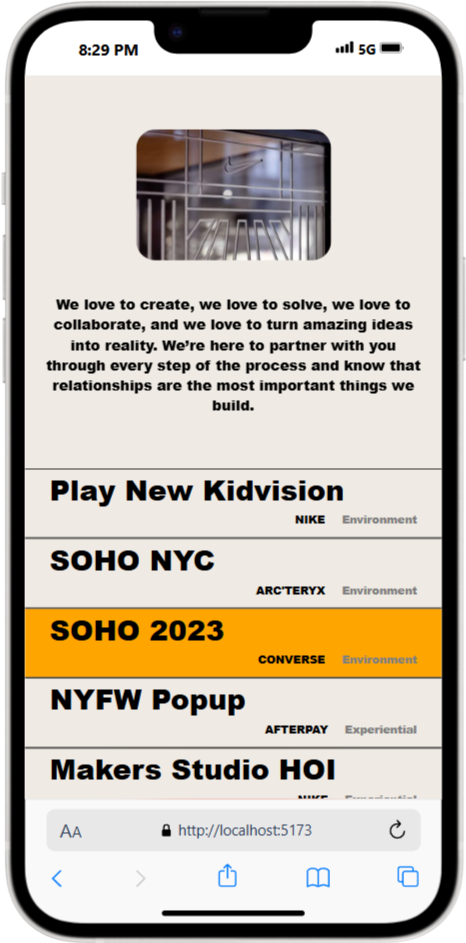

## Overview
Sundown Frontend is a modern web project built to explore smooth scrolling, animation effects, and responsive design. It serves as a learning-based implementation focused on advanced frontend techniques using animation libraries and layout responsiveness.

## Key Features
Smooth scrolling animations powered by a scroll animation library (similar to Locomotive Scroll).

Touch-friendly sliders using Swiper.js for interactive carousels.

Fully responsive design handled through structured media queries.

Clean and modular structure suitable for learning advanced frontend concepts.

## Technologies Used
React (with Vite)

Swiper.js

Scroll animation library (Locomotive-like)

CSS for styling and responsive layout

Media queries for mobile and tablet support

## Learning Goals
Understand and apply smooth scrolling effects and parallax animation.

Integrate Swiper.js for modern, swipe-enabled sliders.

Practice responsive design principles using media queries.

Improve structure and performance of frontend applications using Vite.

